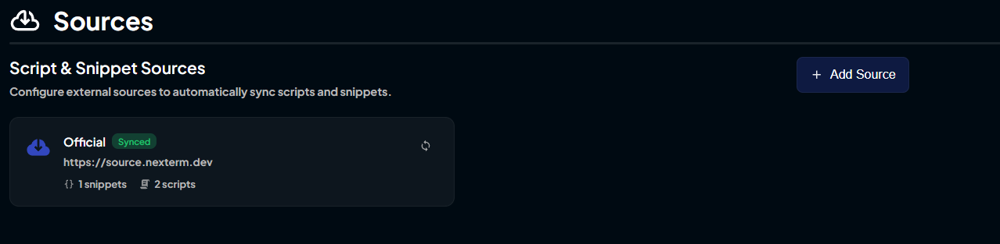
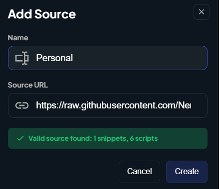
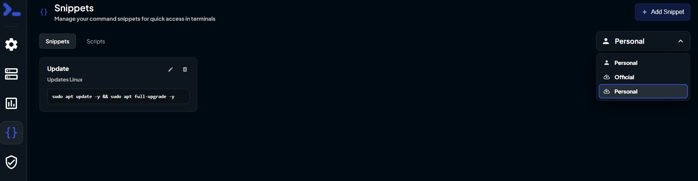
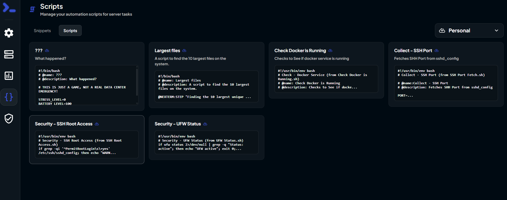

## 🚀 Getting Started with NerdyStore
Welcome to the NerdyStore documentation! This guide will help you get started with using and contributing to the NerdyStore, the (almost) official 3rd party storefront for Nexterm RMM and Nexploy Automation Platform.

## ✅ Prerequisites
Before you begin, ensure you have the following:
- A working computer with your preferred OS
- Basic knowledge of Nexterm RMM and Nexploy Automation Platform
- Access to the NerdyStore GitHub Repository
- A Hosted Nexterm RMM and/or Nexploy instance set up and configured

## 1️⃣ Adding NerdyStore Source to Nexterm/Nexploy
To access the NerdyStore, you need to add it as a custom source in your Nexterm RMM or Nexploy Automation Platform.

1. Log in to your Nexterm RMM or Nexploy instance.
2. Navigate to the "Sources" or "Repositories" section.

3. Click on "Add New Source" and enter the following details:
   - Name: NerdyStore
   - URL: `sources.nerdystore.dev`

   
4. Save the new source.

## 2️⃣ Using NerdyStore Scripts and Apps
Once you have added NerdyStore as a source, you can browse and install scripts, apps, deployment tools, and automation bundles directly from the NerdyStore.

1. Navigate to Snippets/Apps/Automation Bundles section in your Nexterm RMM or Nexploy instance.

2. Switch to the NerdyStore source using the dropdown menu.

## 3️⃣ Run a Script or Install an App!
Chose your desired script or app from the NerdyStore catalog and follow the prompts to install or execute it within your Nexterm RMM or Nexploy Automation Platform.

