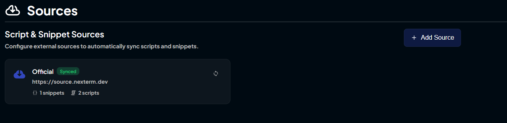
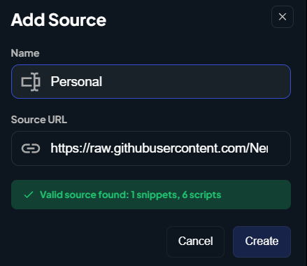
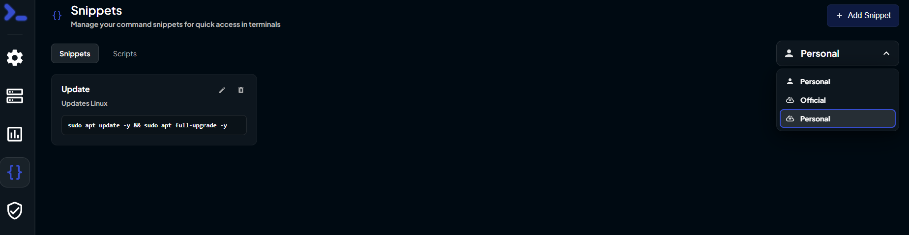
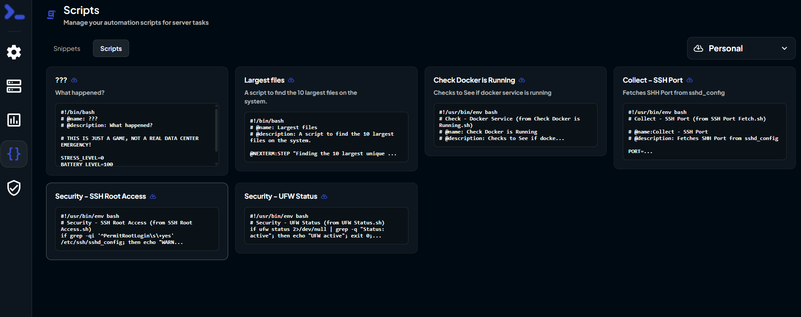

<section class="store-hero">
  

    

      
      NerdyStore Documentation
    

    <h1>NerdyStore</h1>
    

      A third-party storefront for Nexterm and Nexploy, built to make apps,
      scripts, snippets, themes, deployment tools, and automation bundles easy
      to browse and install.
    

    

      <a href="https://store.nerdytech.dev/" target="_blank" rel="noopener noreferrer">Open live store</a>
      <a href="https://github.com/Nerdy-Technician/NerdyStore" target="_blank" rel="noopener noreferrer">View repository</a>
    

  

  

    
  

</section>

<section class="store-stats" aria-label="NerdyStore catalog categories">
  

    <strong>{{ storeStats.nexployApps }}</strong>
    Nexploy apps
  

  

    <strong>{{ storeStats.nextermScripts }}</strong>
    Nexterm scripts
  

  

    <strong>{{ storeStats.nextermSnippets }}</strong>
    Nexterm snippets
  

  

    <strong>{{ storeStats.nextermThemes }}</strong>
    Nexterm themes
  

</section>

{{ statsStatus }}

## Getting Started

  <article>
    1
    <h3>Add the source</h3>
    
Add <code>sources.nerdystore.dev</code> as a custom source in Nexterm or Nexploy.

  </article>
  <article>
    2
    <h3>Browse the catalog</h3>
    
Switch to the NerdyStore source and filter through apps, scripts, snippets, themes, and bundles.

  </article>
  <article>
    3
    <h3>Install or run</h3>
    
Choose an item, follow the prompts, and deploy it directly into your Nexterm or Nexploy workflow.

  </article>

## Add The Source

<section class="store-guide">
  

    <h3>Source details</h3>
    
Use these values when creating a new source in Nexterm or Nexploy.

  

  

    Name
    <code>NerdyStore</code>
    URL
    <code>sources.nerdystore.dev</code>
  

</section>

  <figure>
    
    <figcaption>Open the source or repository settings.</figcaption>
  </figure>
  <figure>
    
    <figcaption>Add NerdyStore as a new source.</figcaption>
  </figure>
  <figure>
    
    <figcaption>Open the relevant catalog area.</figcaption>
  </figure>
  <figure>
    
    <figcaption>Switch the catalog source to NerdyStore.</figcaption>
  </figure>

## Useful Links

  <a href="https://store.nerdytech.dev/" target="_blank" rel="noopener noreferrer">
    
    
      <strong>Live NerdyStore</strong>
      Browse the public storefront.
    
  </a>
  <a href="https://github.com/Nerdy-Technician/NerdyStore" target="_blank" rel="noopener noreferrer">
    
      <svg viewBox="0 0 24 24" role="img">
        <path d="M12 .297c-6.63 0-12 5.373-12 12 0 5.303 3.438 9.8 8.205 11.385.6.113.82-.258.82-.577 0-.285-.01-1.04-.015-2.04-3.338.724-4.042-1.61-4.042-1.61C4.422 18.07 3.633 17.7 3.633 17.7c-1.087-.744.084-.729.084-.729 1.205.084 1.838 1.236 1.838 1.236 1.07 1.835 2.809 1.305 3.495.998.108-.776.417-1.305.76-1.605-2.665-.3-5.466-1.332-5.466-5.93 0-1.31.465-2.38 1.235-3.22-.135-.303-.54-1.523.105-3.176 0 0 1.005-.322 3.3 1.23.96-.267 1.98-.399 3-.405 1.02.006 2.04.138 3 .405 2.28-1.552 3.285-1.23 3.285-1.23.645 1.653.24 2.873.12 3.176.765.84 1.23 1.91 1.23 3.22 0 4.61-2.805 5.625-5.475 5.92.42.36.81 1.096.81 2.22 0 1.606-.015 2.896-.015 3.286 0 .315.21.69.825.57C20.565 22.092 24 17.592 24 12.297c0-6.627-5.373-12-12-12" />
      </svg>
    
    
      <strong>GitHub repository</strong>
      View the source and contribute.
    
  </a>
  <a href="https://docs.nexterm.dev" target="_blank" rel="noopener noreferrer">
    
    
      <strong>Nexterm docs</strong>
      Learn more about the platform.
    
  </a>

